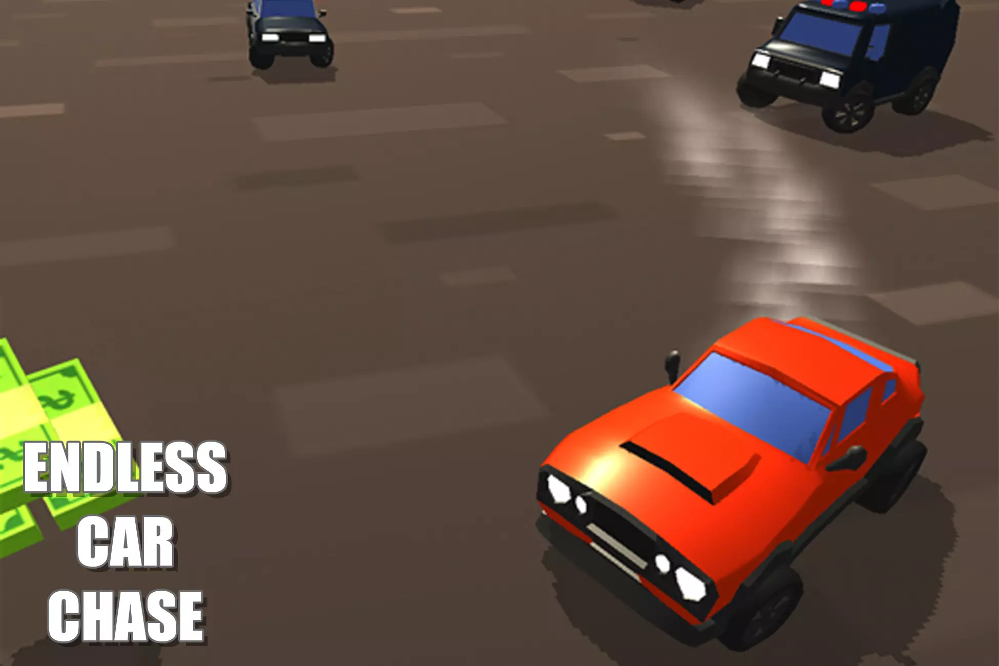
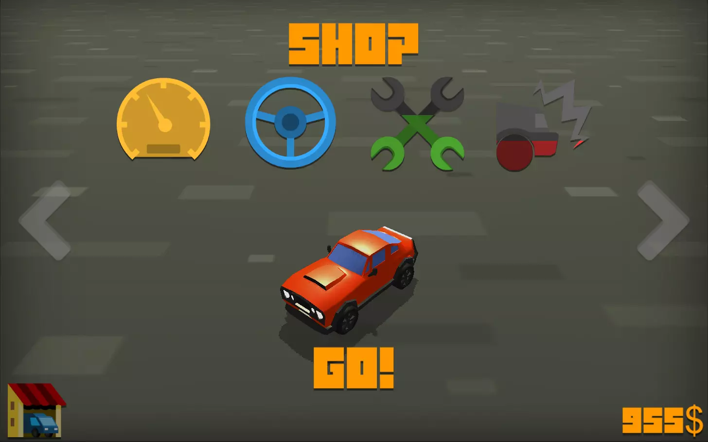
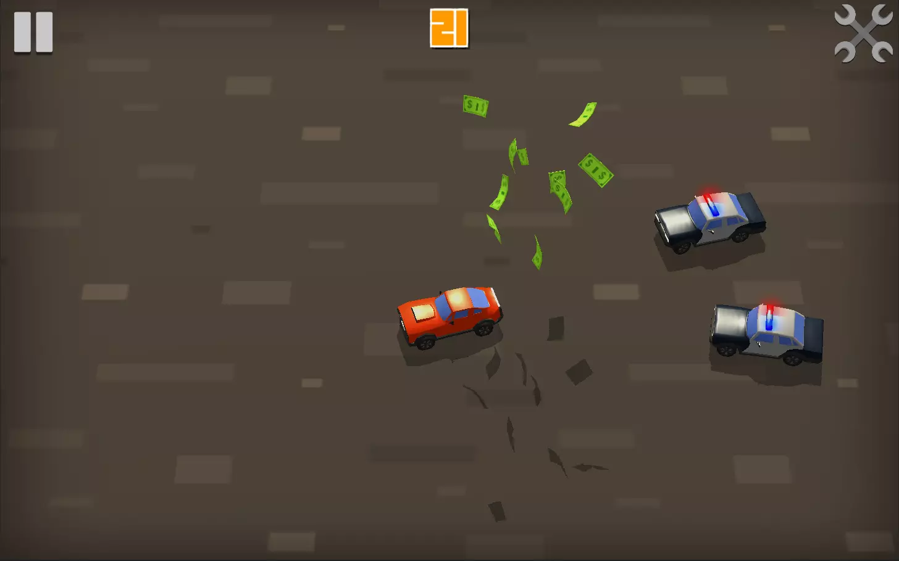
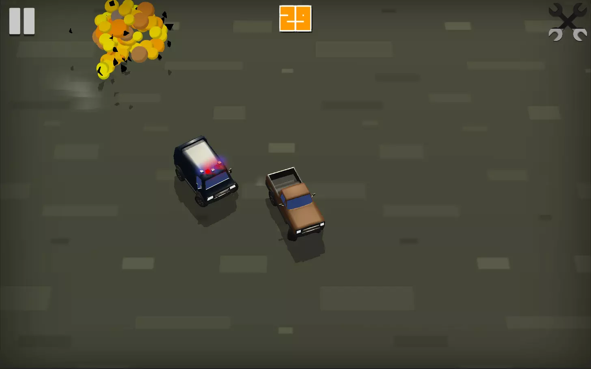
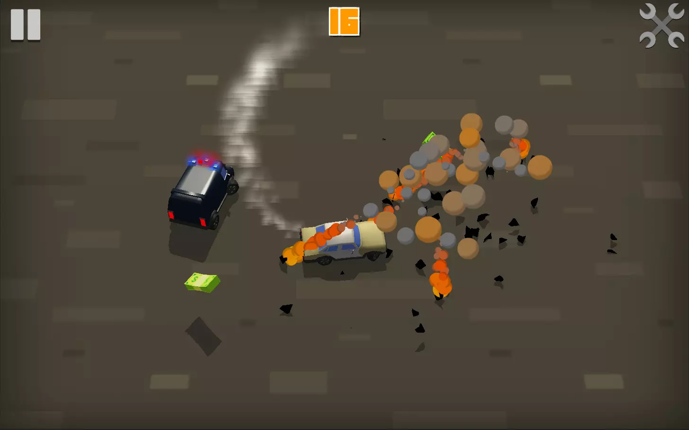
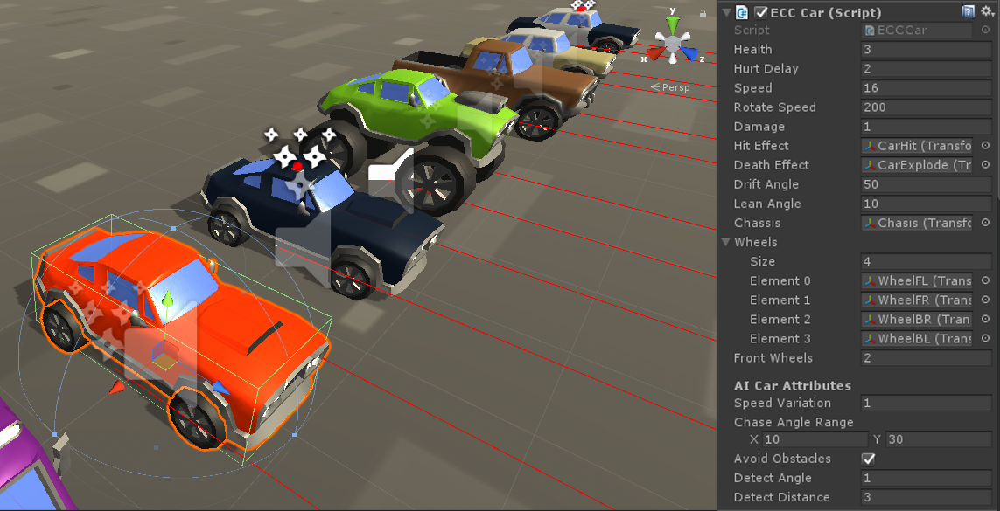

# Endless-Car-Chase-Game

  
  
  
  
  
  

## Documentation
  Endless Car Chase is a fast paced game in which you must collect cash and avoid the police! The game is ready to release straight out of the box, and it can also be easily customized to make it even more engaging to your players. The game supports PC/Mac, iOS, Android, etc. It can be played with the keyboard, gamepad, or touch controls!

## Features:
  * Game ready for release straight out of the box, just build and play!
  * Works on all platforms, PC, Mac, iOS, Android, etc
  * Supports multiple resolutions and aspect ratios, automatically.
  * Supports Mouse, Keyboard, Gamepad, and Touch controls.
  * Easily customizable with lots of options to control game difficulty.

## Attributes:
  # Health – The health of the player. If this reaches 0, the player dies.
  # Hurt Delay – When the car gets hit and hurt, there is a delay during which it cannot be hit again.
  # Speed – The speed of the player, how fast it moves player. The player moves forward constantly.
  # Rotate Speed – How quickly the player car rotates, in both directions.
  # Damage – The damage this car causes when hitting other cars. Damage is reduced from Health.
  # Hit Effect – The effect that appears when this car is hit by another car or by an obstacle.
  # Death Effect – The effect that appears when this car dies.
  # Drift Angle – The slight extra rotation that happens to the car as it turns, giving a drifting effect.
  # Lean Angle – The slight side tilt that happens to the car chassis as the car turns, making it lean inwards or outwards from the center of rotation.
  # Chassis – The chassis object of the car which leans when the car rotates.
  # Wheels – The wheels of the car which rotate based on the speed of the car. The front wheels also rotate in the direction the car is turning.
  # Front Wheels – The front wheels of the car also rotate in the direction the car is turning.
  # Chassis – The chassis object of the car which leans when the car rotates.
  # The same car component is used for the player as well as the computer controlled cars. There are several AI attributes you can control for each car.

* There are also AI specific attributes you can set for cars that are no the player:
  # Speed Variation – A random value that is added to the base speed of the AI car, to make their movements more varied.
  # Chase Angle Range – A random value that is to the chase angle to make the AI cars more varied in how to chase the player.
  # Avoid Obstacles – Make AI cars try to avoid obstacles. Obstacle are objects that have the ECCObstacle component attached to them.
  # Detect Angle – The width of the obstacle detection area for this AI car.
  # Detect Distance – The forward distance of the obstacle detection area for this AI car.
  
